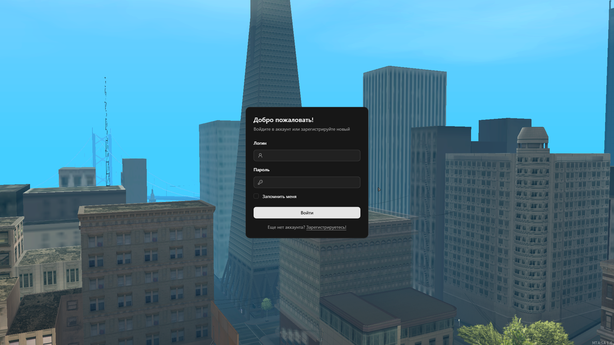
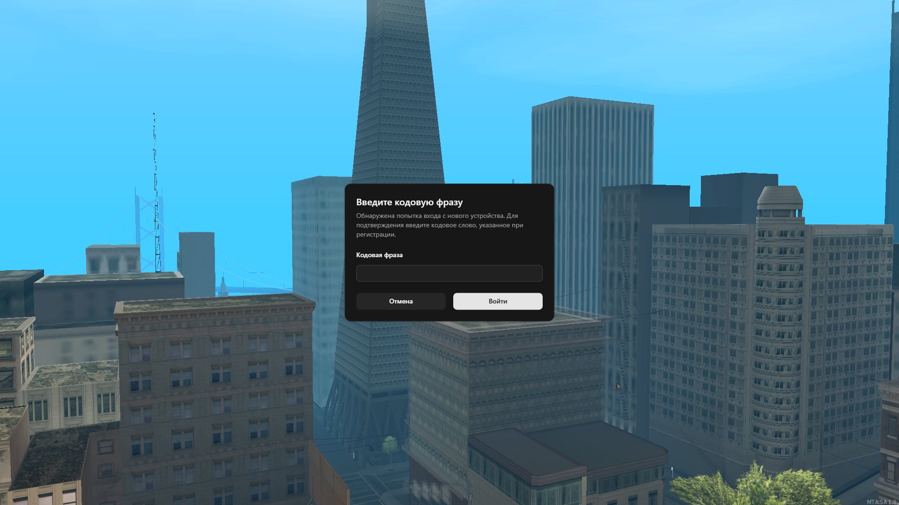
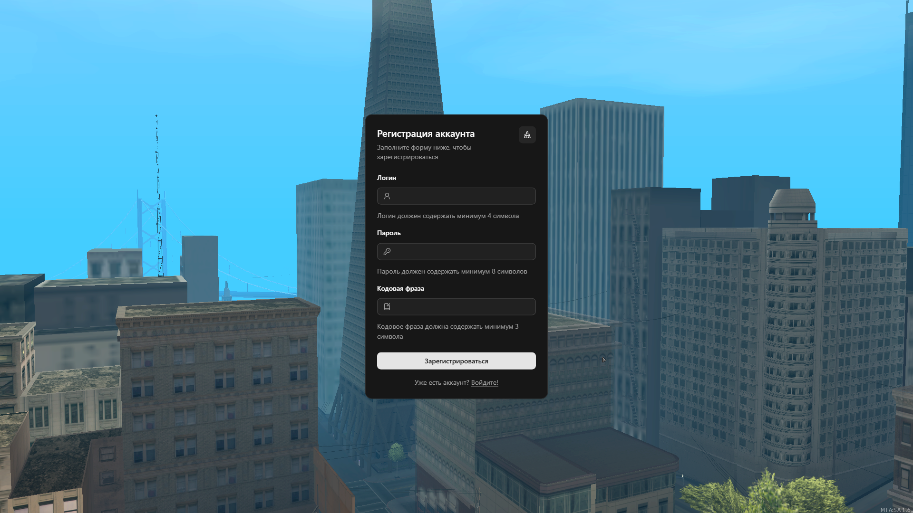
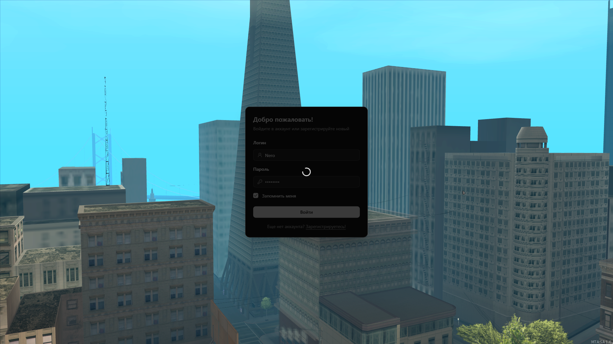
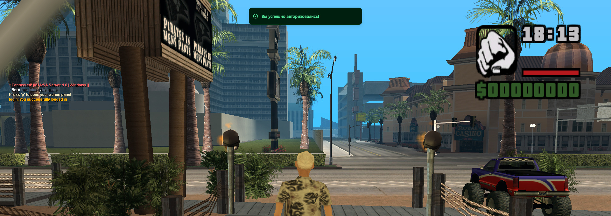

# MTA:SA CEF Login Panel

**Логин панель для MTA:SA 1.6** — система авторизации/регистрации c сохранением данных аутентификации, а также защитой от мультиаккаунтинга и двух-факторной аутентификацией.

## Скриншоты











## Возможности

### Безопасность

- Двух-факторная аутентификация (Запрос кодовой фразы при входе с нового ПК)
- Ограничение создания нескольких аккаунтов с одного ПК
- Автоматический кик при превышении лимита запросов к серверу (авторизация, регистрация, проверка кодовой фразы)
- Регистрация аккаунта с проверкой на уникальность логина
- Шифрование клиентского файла с данными аутентификации

### Особенности

- Авторизация с сохранением данных аутентификации
- Пользовательский интерфейс разработан на современном стеке и внедрен в игровой клиент через CEF (Chromium Embedded Framework).

## Технологии

- **Пользовательский интерфейс:** Vue 3, Shadcn-vue, Vite.
- **Клиентская логика:** Lua (MTA).
- **Серверная логика:** Lua (MTA).
- **Тестирование:** Vitest.

## Установка

1. **Установка в MTA:**
   - Скопировать папку ресурса в`server/mods/deathmatch/resources/`
   - Добавить в`mtaserver.conf`:
     ```xml
     <resource src="login-panel" startup="1" />
     ```
   - Выдать права:`/aclrequest list login-panel allow`.
2. **Сборка интерфейса**
   ```bash
   npm install
   npm run build
   ```
3. **Настройка**
   - Настроить лимиты можно в файле ресурса`meta.xml`
     ```xml
     <settings>
         <setting name='@SignUpAttemptsLimit' value='5' desc="Лимит попыток регистрации"/>
         <setting name='@SignInAttemptsLimit' value='5' desc="Лимит попыток авторизации"/>
         <setting name='@Check2FAAttemptsLimit' value='5' desc="Лимит попыток проверки кодового слова" />
     </settings>
     ```

## Требования

**Минимальная версия клиента и сервера MTA:SA 1.6.0-9.23289.0**
